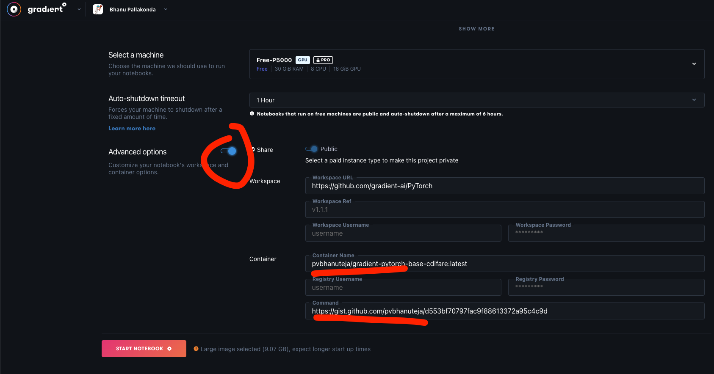
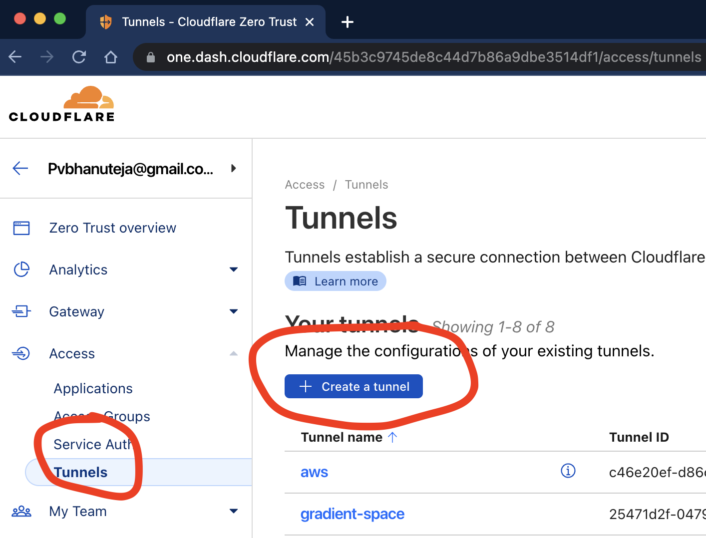
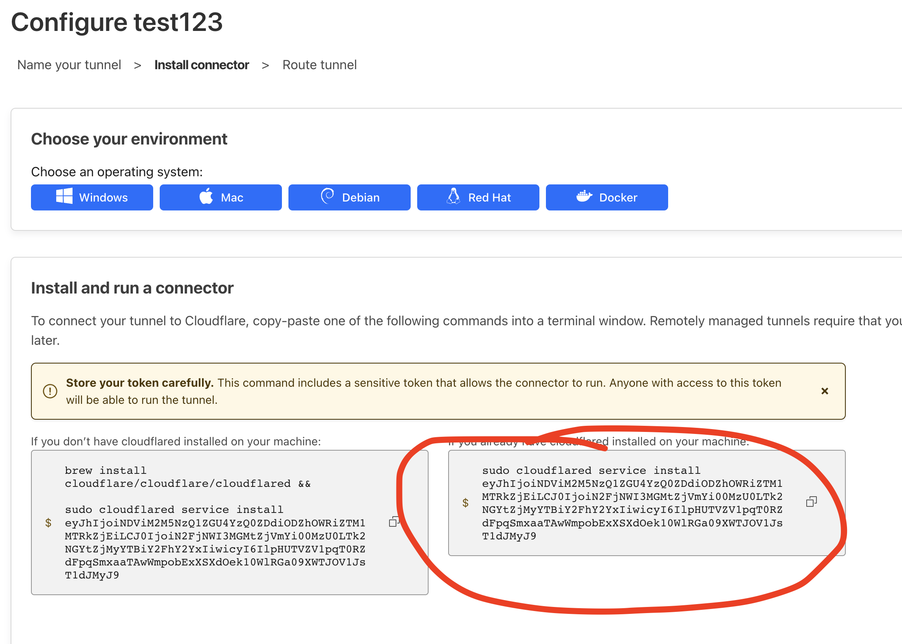
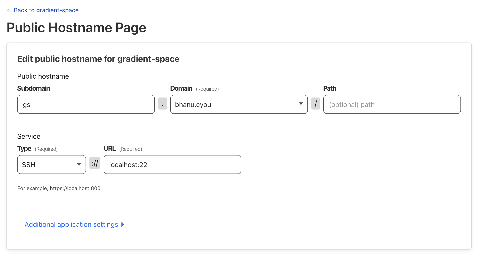

# Deep Learning Docker Image with GPU Support and Quick SSH using Cloudflared

**Note: This image was specifically made for Paperspace Gradient but can be used for any other cloud service provider that supports Docker images. Make modifications if needed. Has pytorch1.12, tf29, jax0317, py39 support**

You can find github repo [here](https://github.com/pvbhanuteja/gs-dl-baseimage-cloudflared).

Let's go through the steps to set up a deep learning Docker image with GPU support and how to quickly SSH into the server using Cloudflared if the server is not publicly accessible.

## Prerequisites

1. Install Cloudflared based on your OS from the [official documentation](https://developers.cloudflare.com/cloudflare-one/connections/connect-apps/install-and-setup/installation/). In our example, we will use `brew install cloudflared`.
2. Make a Github Gist with the following content which will be used as your configuration file. Look at `config.sh` for reference. 
3. Use the following Docker image while launching your Gradient paperSpace notebook: in the advanced settings `gs-dl-baseimage-cloudflared:latest` and in the commands section put in your Github Gist URL.
4. While launching your Gradient Space notebook, you should see something like this, and a sample Gist URL would look something like this `https://gist.github.com/pvbhanuteja/51b72804985318dccae8c0d8e948bf18`.




## Accessing the Server

1. Once your server is up and running, you can access it using the provided Cloudflare URL. The URL will be commented on your Github Gist URL automatically, or it can also be found in the Gradient Space logs. The first one is easier. **Remove the `https://` part from the URL.**
2. In your local terminal, enter the following command, replacing `<path_to_cloudflared>` and `url` with the appropriate values:


For example:


```
ssh -o "ProxyCommand=<path_to_clodflared> access ssh --hostname %h" -o StrictHostKeyChecking=no -o UserKnownHostsFile=/dev/null root@example.com

For example:

ssh -o "ProxyCommand=cloudflared access ssh --hostname %h" -o StrictHostKeyChecking=no -o UserKnownHostsFile=/dev/null root@finally-humans-faces-closed.trycloudflare.com
```


Now you should have access to the server.

## Using Your Domain (Optional)

If you want to use your own domain instead of the provided Cloudflare URL, follow these steps:

1. Update your config file; look at `config.sh` for reference.
2. Create a new tunnel on Cloudflare by going to https://one.dash.cloudflare.com/ and navigating to **Tunnels > Create a new tunnel**.



3. Copy the tunnel token to use it in your config.



4. **Once you deploy the Docker, your tunnel will be up and running. You must run the Docker image like discussed at the start before running the below steps.**
5. You can configure the tunnel once it is up and running by going to **Tunnels > Click on your tunnel > Configure**.



6. Configure your tunnel and provide the domain name (you will have all your domains in the drop-down menu). Choose any subdomain of your choice, such as `workstation`. Make sure the service is pointed like the following URL: `localhost:22`, and the type is `ssh`.


```
ssh -o "ProxyCommand=<path_to_clodflared> access ssh --hostname %h" -o StrictHostKeyChecking=no -o UserKnownHostsFile=/dev/null root@<YOUR_SUBDOMAIN_CREATED_ON_CLOUDFLARE>

For example:

ssh -o "ProxyCommand=cloudflared access ssh --hostname %h" -o StrictHostKeyChecking=no -o UserKnownHostsFile=/dev/null root@gs.bhanu.cyou
```

## Short demo video 
https://www.loom.com/share/a3fce56c76984f81a051cbec27822576

## On Other Cloud Providers

If you are using this on other cloud providers, you can use the following Docker image: `gs-dl-baseimage-cloudflared:latest` along with gist url while running the docker image.

```
docker run -it pvbhanuteja/gs-dl-baseimage-cloudflared:latest <GIST_URL>
```


Congratulations! You have successfully set up a deep learning Docker image with GPU support and quick SSH access using Cloudflared.

I hope this was helpful. If you have any questions or comments, feel free to ask or open issue/pr on github.
